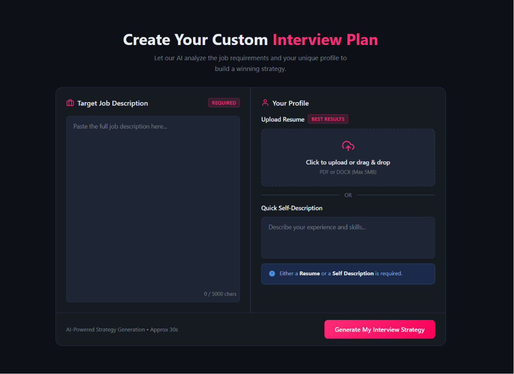
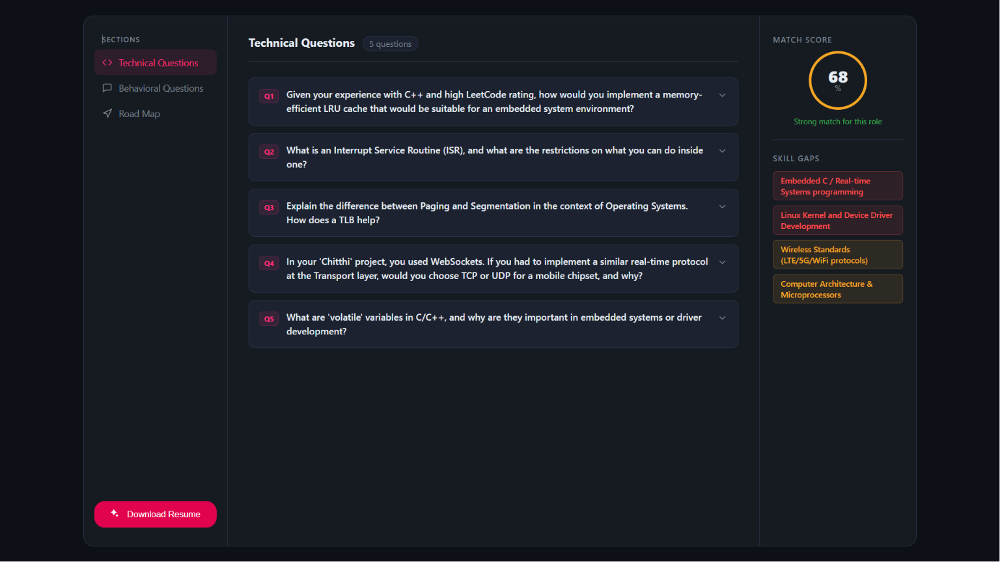
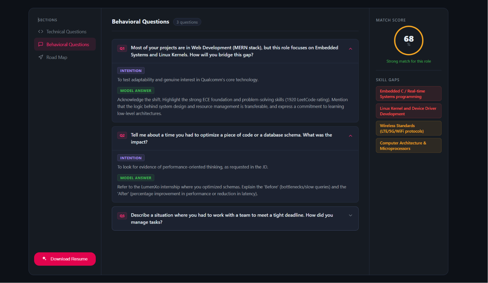
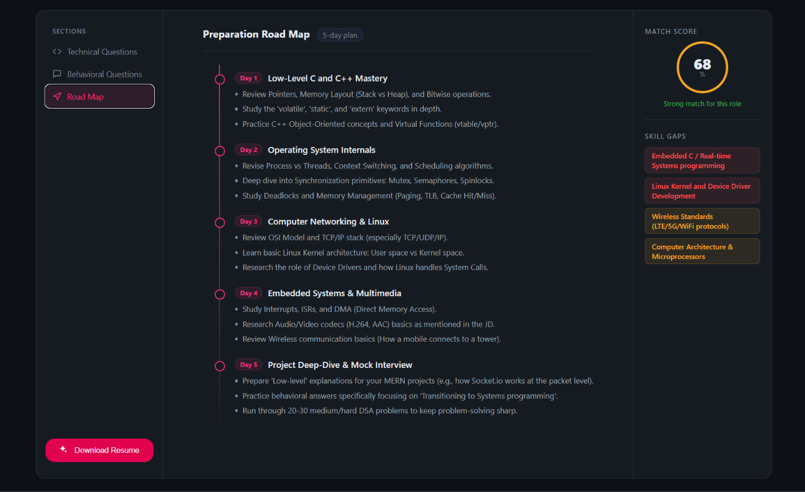

# GenAI Resume Parser

I built this because I was tired of blindly tailoring my resume for every job posting with no real idea if it actually matched what the role wanted. So I made a tool that tells me straight up — here's your match score, here's what you're missing, and here's a plan to fix it before the interview.

It's a full-stack app (React + Express + MongoDB) that uses Google's Gemini LLM to parse a resume against a job description, score the match, generate an interview prep plan, and even render a tailored resume as a PDF.

---

## What it does

- Takes a job description + your resume (or just a quick self-description) and gives you a match score with actual reasoning, not just a random percentage
- Generates a full interview prep plan — technical questions, behavioral questions, and a day-by-day roadmap — based on the specific gaps between your profile and the role
- Renders a tailored, recruiter-ready resume as a PDF using headless Chromium
- Every AI response is schema-validated before it hits the frontend, so I'm not just trusting the model to "behave"

### Input screen

You paste the JD on the left, and either upload a resume or describe yourself on the right. That's it, that's the whole input.

### What you get back

This is the part I use the most — technical questions generated specifically off my profile and the JD, plus a match score and skill gap breakdown on the right so I know exactly what to go study.

For behavioral questions I added an "Intention" (why they're probably asking this) and a model answer that references my actual projects, not some generic STAR-method filler.

And a 5-day roadmap that sequences what to study based on the gaps it found, so I'm not just told what's missing — I get told what to do about it, in order.

---

## Stack

- **Frontend:** React
- **Backend:** Express / Node.js
- **DB:** MongoDB
- **AI:** Google Gemini
- **PDF rendering:** Puppeteer (headless Chromium)
- **Auth:** JWT + token blacklist for logout/revocation
- **Validation:** Zod + zod-to-json-schema

## The core engineering problem I had to solve

LLMs are probabilistic — ask the same thing twice and you can get differently shaped responses. That's a problem when my frontend needs a consistent JSON structure to render into UI.

So every prompt to Gemini is paired with a Zod schema, converted through zod-to-json-schema, and passed in as a structured output constraint. Gemini's JSON mode is forced to return data matching that shape. Basically I turned a chat model into something that behaves like a predictable, typed API.

One thing I always make sure to clarify when talking about this project: **I'm not training or fine-tuning any models here.** This is an application built on top of a foundation model — the engineering is in the prompting, the schema constraints, and making an inherently unpredictable API production-usable. Big difference between "using GenAI" and "building GenAI," and I want to be upfront about which one this is.

---

## Bugs I know about (and haven't fixed yet)

- **IDOR on the PDF generation endpoint** — there's no ownership check right now, so technically someone could hit the endpoint for a resume that isn't theirs. Needs fixing before this touches real user data.
- **No retry/fallback if the AI response fails validation** — if Gemini returns something that doesn't match my schema, it just fails instead of retrying or falling back gracefully.

Leaving these here instead of hiding them because I'd rather be upfront about where the rough edges are.

---

## Why I made these choices

- **MongoDB over a relational DB** — resume and JD data is naturally document-shaped, didn't need rigid joins, so I went with the schema flexibility
- **JWT + blacklist instead of sessions** — wanted stateless auth but still needed real logout/revocation
- **Puppeteer over a PDF library like PDFKit** — costs more overhead but I get pixel-perfect, real-CSS resume rendering instead of fighting a limited PDF DSL
- **Gemini model tier** — picked with cost/latency/quality tradeoffs in mind for structured extraction specifically, not just grabbing the biggest model available

---

## What's next

- [ ] Fix the IDOR bug on PDF generation
- [ ] Add retry/fallback logic for failed AI validations
- [ ] More test coverage around schema validation edge cases
- [ ] Rate-limiting on Gemini calls so cost doesn't get out of hand at scale

---

Built this mainly to actually understand what it takes to ship a GenAI feature end-to-end — not just call an API and hope, but design around how it actually behaves.
